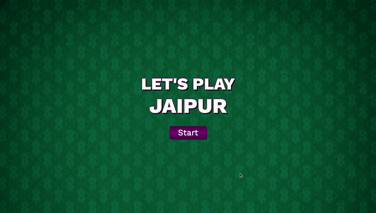
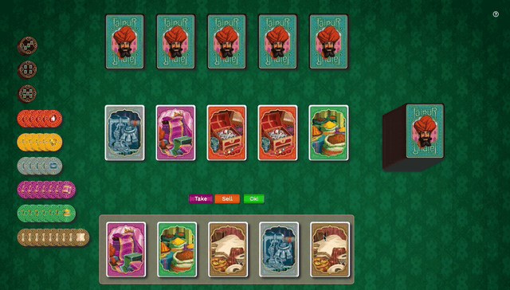
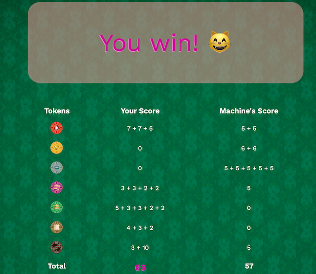

# Jaipur

Jaipur is a web adaptation of the homonymous board game in which the player will be competing against the machine to become the best (and richer) trader. 

## Rules
In this version of Jaipur there won't be any camels and it'll be a one round game, but the rules are essentially the same as in the original game. Each turn you can either take one card from the market, exchange several goods (at least two) at the market or choose one type of good to sell. Selling goods grants you points in the form of goods tokens and bonus tokens. The game ends when there are no cards left in the draw pile or if all tokens from three type of goods have been sold. Player with the highest score wins the game!  
Be aware that there are some aditional rules to the game, so go ahead and take a look at them before playing [[EN]](https://www.fgbradleys.com/rules/rules2/Jaipur-rules.pdf) - [[ES]](https://www.jugonesweb.com/wp-content/uploads/2016/05/Instrucciones-Jaipur.pdf).

## Demo

Live version: [https://anasegarra.github.io/Jaipur/](https://anasegarra.github.io/Jaipur/)

## Features
* Landing page shows game's title and a start button
* Instructions displayed along with the board when clicking start
* On the top right corner of the screen a question mark icon displays the game rules when clicked
* When the round ends, a scoreboard and a final message are shown

**User's actions:**

On each turn player can click take or sell buttons and confirm their chosen action by clicking ok button.
* Take button:
  - Choose one single card from the market
  - Choose same number of cards from the market and from your hand to exchange
* Sell button:
  - Choose as many cards as you want of one type of good to sell 

**To do:**
* Improve machine's intelligence
* Include camels from the original board game

## Technologies
* HTML5 and CSS3 to get the structure and styling of the game
* JavaScript for DOM manipulation, event handling and overall game's functionality 

## Overview
This is the first of three projects to be made during the Ironhack Web Development Bootcamp. It has been a great opportunity to develop a game from the ground up, not following any kind of guideline or tutorial whatsoever. 
This project is heavily based on manipulation of the DOM using vanilla JavaScript to get the movements of the cards and handling user's interaction. The game logic has been implemented following the principles of Object Oriented Programmnig. Images of the game have been cut out and edited from [this image](https://cdn.shopify.com/s/files/1/1402/8033/products/jaipur-cards-and-tokens_597x700.jpg?v=1519748183) of the board version. As stated above, HTML5 was used to set up the structure of the game and its layout was built using CSS flexbox.

## Contributing
If you wish to contribute to this project, you may add yourself to [CONTRIBUTING.md](https://github.com/AnaSegarra/Jaipur/blob/master/CONTRIBUTING.md).

## License
Please refer to [LICENSE.md](https://github.com/AnaSegarra/Jaipur/blob/master/LICENSE.md).

## Author
This game was built by [@AnaSegarra](https://github.com/AnaSegarra) for the Ironhack Web Dev Bootcamp in December of 2019.
